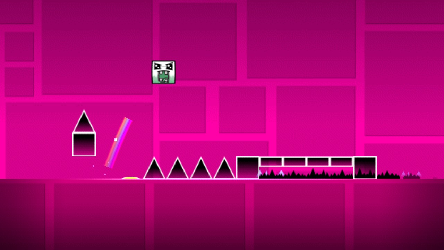
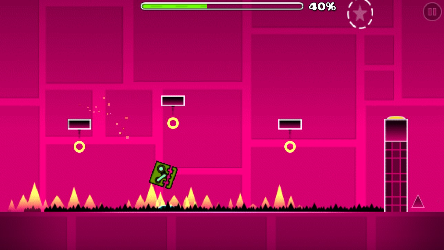
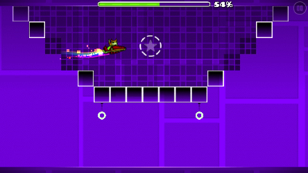
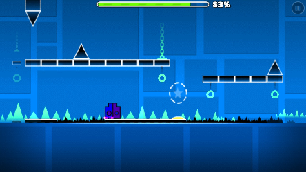

# Back on Track

### Times
Time: 1:21.15

## Information
- Awards 2 stars and 75 mana orbs
- Has two achievements associated with it:
  - On my way: Complete in practice mode.
  - Back On Track!: Complete in normal mode.

## Coin Routes
1. Easy. Drop down at 40% to hit a hidden gravity pad.

2. Easy. Go inside the 3rd structure at 54%.

3. Easy. Fall down at 82% and jump across.

## Minimal Jump Count
- Cube 1: 52 Jumps -> Take the First Coin.
- Ship 1: 0 Jumps
- Cube 2: 34 Jumps -> Take the Third Coin.

Total: 86 Jumps
