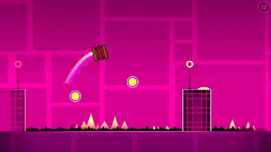
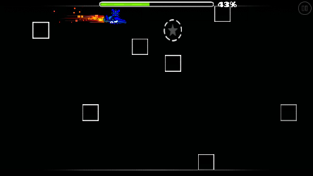
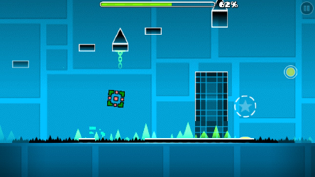
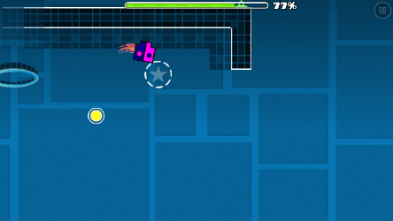

# Polargeist

### Times
Time: 1:29.59

## Information
- Awards 3 stars and 100 mana orbs upon completion
- Has three achievements associated with it:
  - Polarbear: Complete in practice mode.
  - Polargeist!: Complete in normal mode.
  - Steamrolling!: Complete alongside [Stereo Madness](stereomadness.md) and [Back on Track](backontrack.md) in normal mode on PC.

## Coin Routes
Coin 1. Easy. Hold up at 43%

Coin 2. Easy. Fall down at 62% and jump across.

Coin 3. Hard. Jump earlier than normal at 75% and hit a hidden gravity pad. Hit the next yellow orb as you go up. Be ready to jump as soon as you fall down!

## Minimum Jump Count
- Cube 1: 45 Jumps
- Ship 1: 0 Jumps
- Cube 2: 73 Jumps

Total: 118 Jumps
