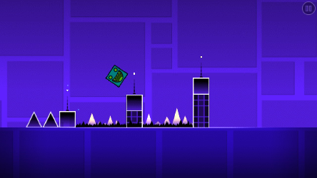
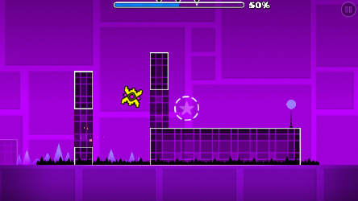
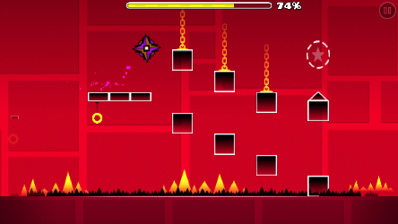
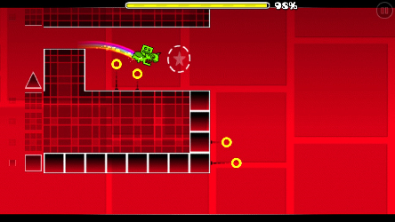

# Stereo Madness

### Times
Time: 1:25.54

## Information
- Awards 1 star and 50 mana orbs upon completion
- Has two achievements associated with it:
  - Stereo Bump: Complete in practice mode.
  - Stereo Madness!: Complete in normal mode.

## Coin Routes
1. Easy. Drop down at 49%.

2. Easy. Jump above the descending blocks at 74%, and jump on the third block.

3. Medium. Hold up at 89% to enter a secret corridor that leads to the coin.

## Minimum Jump Count
- Cube 1: 29 Jumps
- Ship 1: 0 Jumps
- Cube 2: 48 Jumps -> Take the First Coin, don't take Coin 2.
- Ship 2: 0 Jumps

Total: 77 Jumps
